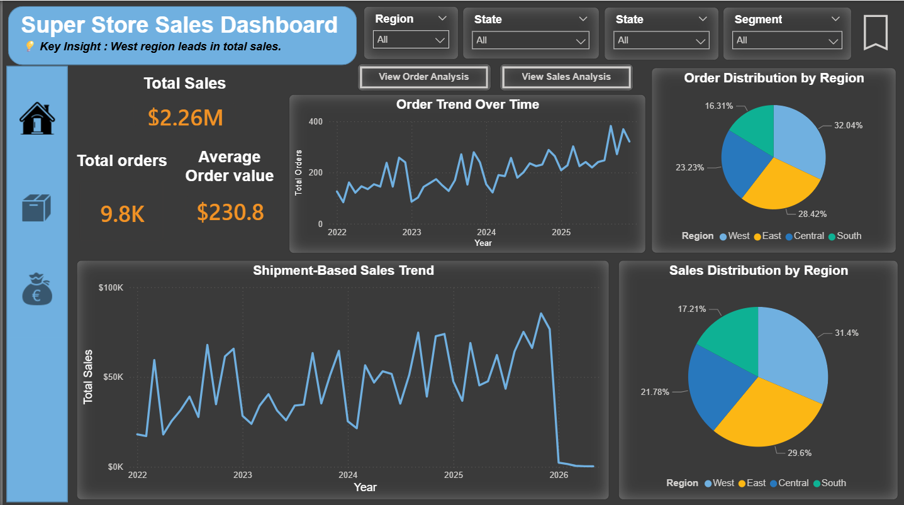
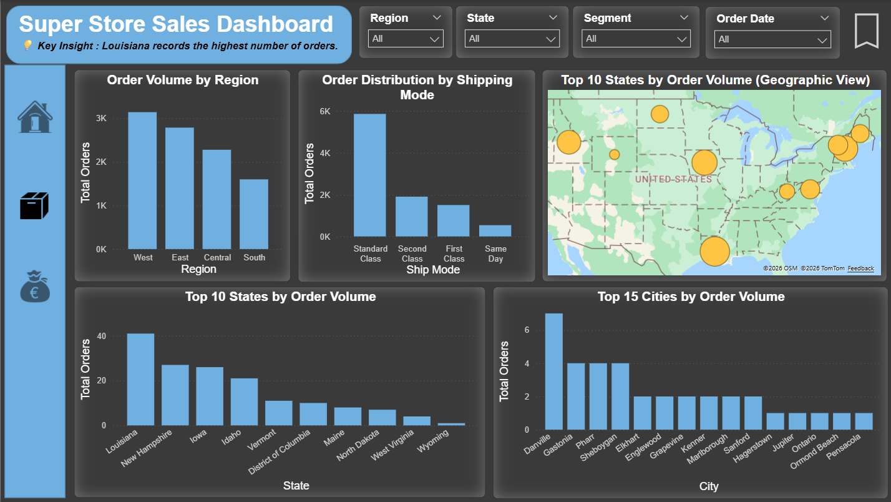
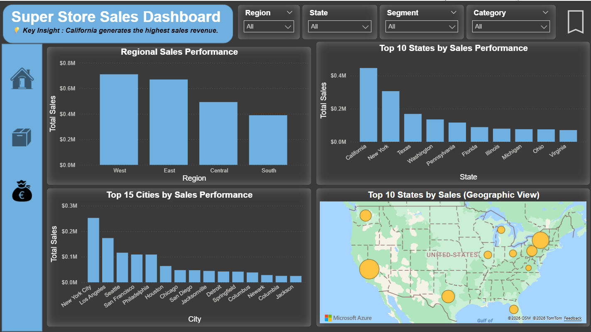

# 📊 Superstore Sales Dashboard | Power BI

## 📌 Project Overview
This project is an interactive multi-page Power BI dashboard built using the Superstore dataset to analyze sales and order performance across regions, states, and cities.

The dashboard is designed to provide business insights through KPI monitoring, trend analysis, geographic analysis, and location-based performance reporting.

---

## 🚀 Dashboard Features

### 🏠 Home Page
- Order Trend Over Time
- Shipment-Based Sales Trend
- Order Distribution by Region
- Sales Distribution by Region
- Key business insights

### 📦 Orders by Location
- Order Volume by Region
- Order Distribution by Shipping Mode
- Geographic Distribution of Orders by State
- Top 10 States by Order Volume
- Top 15 Cities by Order Volume

### 💰 Sales by Location
- Regional Sales Performance
- State-Level Sales Performance
- City-Level Sales Performance
- Geographic Sales Distribution (Top 10 States)
- Top 15 Cities by Sales Performance

---

## 📈 Key KPIs
- Total Sales
- Total Orders
- Average Order Value

---

## 🛠 Tools & Technologies
- Microsoft Power BI
- Power Query
- DAX
- Data Modeling
- Data Visualization

---

## 💡 Key Business Insights
- West region leads overall sales performance.
- California generated the highest sales revenue.
- Order activity is concentrated in top-performing states and cities.

---
## 📥 Download Power BI File

Download the Power BI dashboard file here:  
[Download PBIX](./Super_Store_Sales_Dashboard.pbit)

---

## 🎥 Dashboard Demo
Watch the dashboard walkthrough here:  
[Add your YouTube Video Link Here]

---

## 📷 Dashboard Preview

---

## 📂 Repository Files
- `Superstore_Sales_Dashboard.pbix`
- `Super_Store_Sales_Dashboard_Page_1.png`
- `Super_Store_Sales_Dashboard_Page_2.png`
- `Super_Store_Sales_Dashboard_Page_3.png`
- `README.md`

---

## 👨‍💻 Created By
**Tharindu Shyaman**  
Data Analyst | Power BI Developer | Python Learner

📧 Email: tharindushyaman1999@gmail.com  
🔗 LinkedIn: https://www.linkedin.com/in/tharindu-shyaman-b032242b8

---
